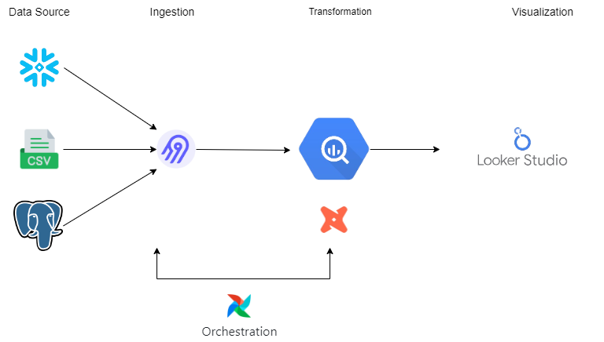

# capstone-project-ELT


## Tools
* Snowflake (Data Source 1)
* CSV (Data Source 2)
* Postgres (Data Source 3)
* BigQuery (Data Warehouse)
* Airbyte (Ingestion)
* Airflow (Orchestration)
* DBT (Transformation)

## Data Pipeline Design
This data pipeline uses the ELT concept, because it uses Airbyte as an ingestion tool


## ERD


## Runnning Project
Clone This Repository
```
git clone https://github.com/awinardi1004/capstone-project-ELT.git
```
Run docker [compose](airbyte/docker-compose.yml) to use airbyte
```
docker-compose -f airbyte/docker-compose.yml up
```
