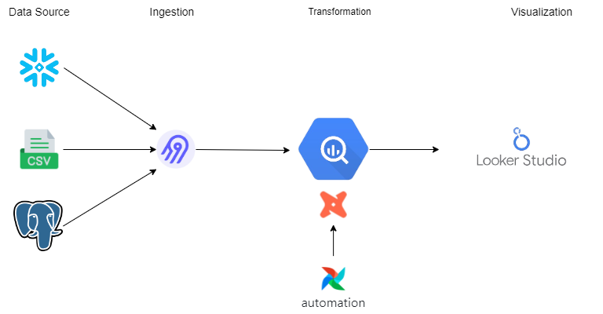
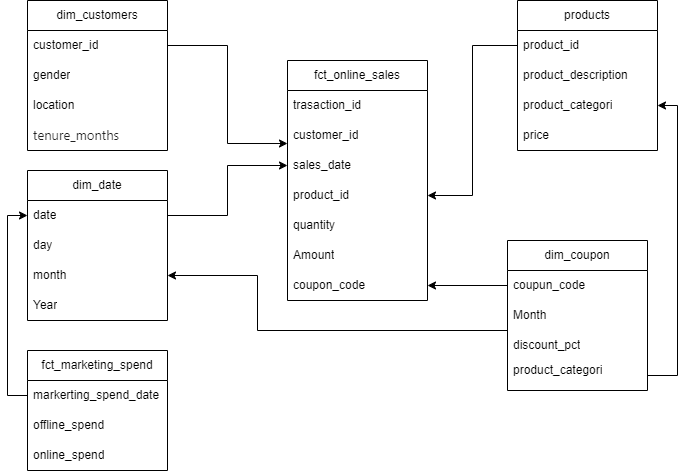
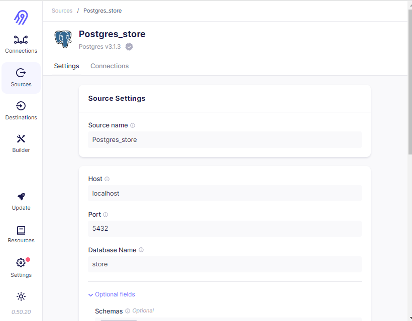
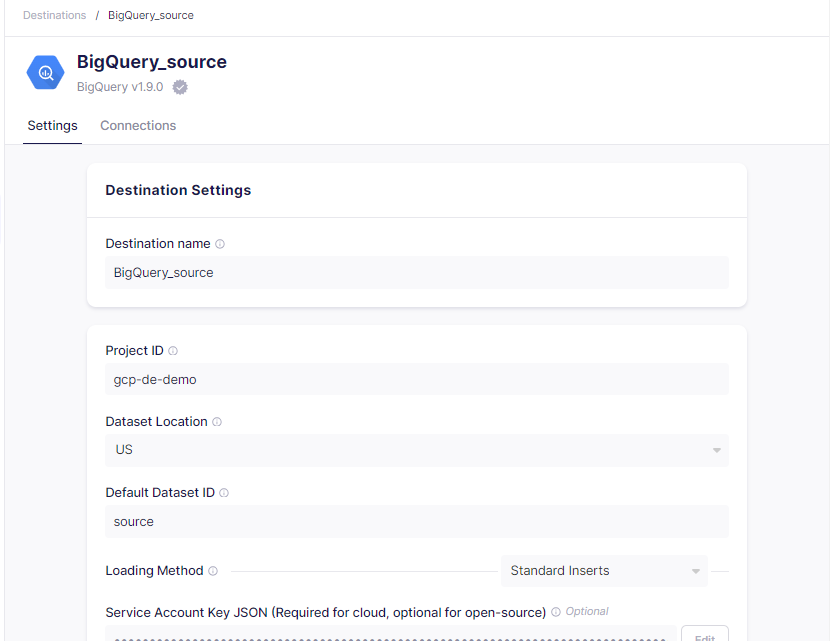
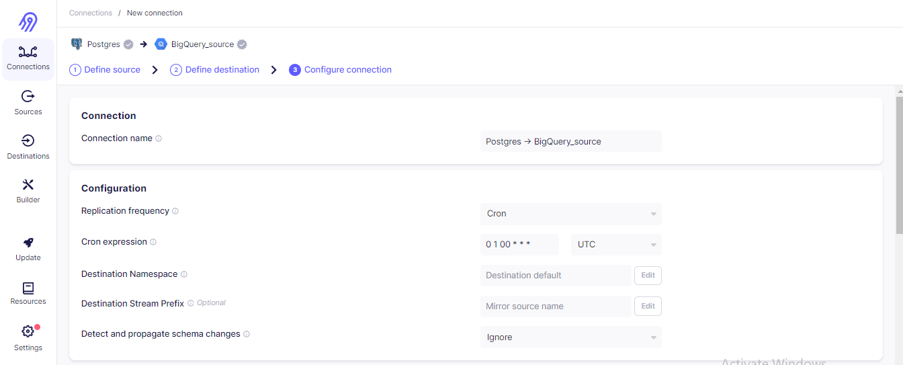

# capstone-project-ELT


## Tools
* Snowflake (Data Source 1)
* CSV (Data Source 2)
* Postgres (Data Source 3)
* BigQuery (Data Warehouse)
* Airbyte (Ingestion)
* Airflow (Orchestration)
* DBT (Transformation)

## Data Pipeline Design
This data pipeline uses the ELT concept, because it uses Airbyte as an ingestion tool


## ERD


## Clone This Repository
```
git clone https://github.com/awinardi1004/capstone-project-ELT.git
```
## Ingesting data on Airbyte
Run docker [compose](airbyte/docker-compose.yml) to use airbyte
```
docker-compose -f airbyte/docker-compose.yml up
```
Then open `localhost:8000` to access Airbyte.
```
Username: airbyte
Password: password
```
Create your source.



Create your destination.



Connect your data source with your data destination on Airbyte. At this stage you can schedule the data load.


